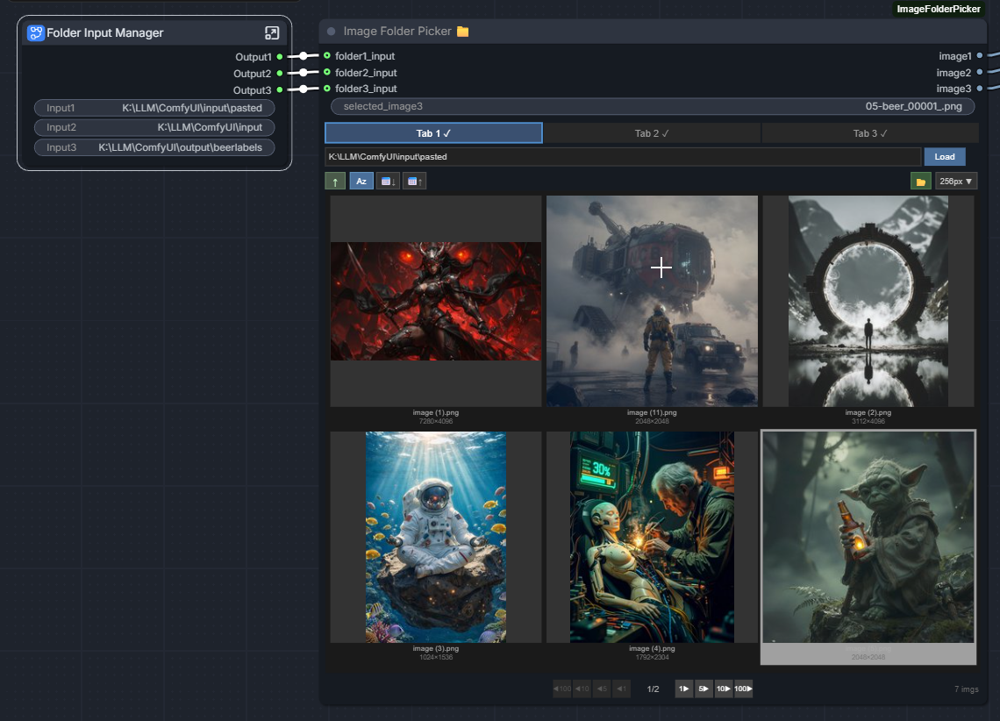

# ComfyUI Image Folder Picker 📁

A custom node for ComfyUI that allows you to browse a folder of images and select one from a thumbnail gallery directly within the node interface.

## Features

- **5 Independent Tabs**: Load up to 5 different images simultaneously from different folders
- **Folder Browser**: Text input with folder dialog button to select image directories
- **Thumbnail Gallery**: Visual grid of image thumbnails rendered directly in the node
- **Click to Select**: Click any thumbnail to select it as the output image
- **Indexable Gallery**: Arrow navigation to browse through large image collections
- **Cached Thumbnails**: Thumbnails are stored in a `.thumbs` subfolder for fast loading in different sizes
- **Image Count**: Displays total number of images in the selected folder
- **Zoom In preview**: Double click to open a preview of the image in a larger window
- **Folder support**: Works with local folders on your machine
- **Alpha Channel Output**: Each tab outputs both the image and its alpha channel as a mask

## Installation

1. Navigate to your ComfyUI `custom_nodes` folder
2. Clone or copy this folder: `ComfyUI-ImageFolderPicker`
3. Restart ComfyUI

## Usage

1. Add the **Image Folder Picker 📁** node from the `image` category
2. Use the 5 tabs to configure different image sources
3. Click **Browse Folder** to select a folder containing images
4. Thumbnails will load and display in the node
5. Click any thumbnail to select that image
6. Each tab outputs its selected image and alpha mask

## Outputs

| Output | Type | Description |
|--------|------|-------------|
| `image1-5` | IMAGE | The selected images from each tab as tensors |
| `mask1-5` | MASK | Alpha channels extracted as masks (white = transparent areas) |

## Inputs

Each tab has both a widget input and an optional string input for the folder path:
- `folder1-5`: Widget text input for folder path
- `folder1-5_input`: Optional STRING input (overrides widget when connected)

- JPEG (.jpg, .jpeg)
- PNG (.png)
- WebP (.webp)
- GIF (.gif) - first frame only
- BMP (.bmp)
- TIFF (.tiff, .tif)

## Thumbnail Caching

Thumbnails are automatically generated and cached in a `.thumbs` subfolder within your image folder. This speeds up subsequent loads. Click the **Refresh** button to regenerate thumbnails if your images have changed.

## Screenshots

## License

MIT License
